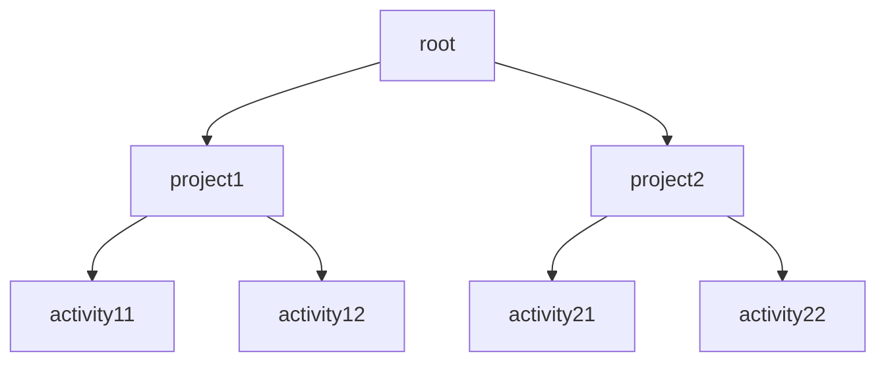

# Tag Tree Timewarrior extension

This [Timewarrior extension](https://timewarrior.net/docs/extensions/) calculates the total time tracked on each tag for the closed intervals received in the input based on a preconfigured hierarchical tree.

The objective is to define a hierarchy between tags and have a breakdown on how much time has been tracked for each of them with the total of each tag being the total of all the tags that sit below it.

The output is printed *à la* GNU [tree](https://linux.die.net/man/1/tree) utility.

## Installation
1. Download the latest executable for your operating system from the [releases page](https://github.com/crossbone-magister/tag-tree/releases).
2. Add it to the Timewarrior extension folder as described in the [documentation](https://timewarrior.net/docs/api/).
3. Verify that the extension is active and installed by running `timew extensions`.

## Configuration

### Hierarchy
To define a starting hierarchy add a series of timewarrior properties in this format:
```properties
reports.tagtree.hierarchy.<ID> = tag1 tag2 ... tagN
```
For example:
```properties
reports.tagtree.hierarchy.1 = project1 activity12
reports.tagtree.hierarchy.2 = project1 activity12
reports.tagtree.hierarchy.3 = project2 activity21
reports.tagtree.hierarchy.4 = project2 activity22
...
```
will generate the following hierarchy tree:


All the tags not inside the predefined tree will be added one by one, in the order they are received, as children of the lowest existing tag. This will save the user from adding every single tag to the structure.

> **Note**: Tags defined in the hierarchy will have an higher priority than new tags when calculating totals.

> **Warning**: Not configuring a starting hierarchy tree at all might produce unwanted output.

> **Warning**: Reusing the same tag at different levels of the hierarchy tree might produce unwanted output.

### Pruning
The final hierarchy tree might contain branches or leaves with a total duration of zero, that might clutter the final output.
It is possible to configure the extension to remove (*prune*) them.

To enable pruning run:
```bash
timew config reports.tagtree.prune true :yes
```
To disable pruning run:
```bash
timew config reports.tagtree.prune :yes
```

> **Note**: Pruning is disabled by default.

> **Note**: As long as the `reports.tagtree.prune` configuration key is present, pruning will be enabled regarding of its value.

### Max Depth
This configuration allows to print the final hierarchy tree up to a certain level (*depth*).

To configure a max depth run:
```bash
timew config reports.tagtree.maxdepth N :yes
```
To disable max depth run:
```bash
timew config reports.tagtree.maxdepth :yes
```
> **Note**: Max depth is disabled by default.

> **Note**: Any value of **N** that is not a positive number will produce an error on the output and the application will print the whole hierarchy tree.

> **Note**: The hierarchy depth starts at zero. Here's the example hierarchy, with each node annotated with its depth.
>
>```mermaid
>graph TD
>    root["0 - root"]
>    project1["1 - project1"]
>    project2["1 - project2"]
>    activity11["2 - activity11"]
>    activity12["2 - activity12"]
>    activity21["2 - activity21"]
>    activity22["2 - activity22"]
>
>    root --> project1
>    root --> project2
>    project1 --> activity11
>    project1 --> activity12
>    project2 --> activity21
>    project2 --> activity22
>```

## Usage
In a terminal window, run `timew tag-tree`.

For example, running the following commands:
```bash
# Configuring Hierarchy
$ timew config reports.tagtree.hierarchy.1 project1 activity12 :yes
$ timew config reports.tagtree.hierarchy.2 project1 activity12 :yes
$ timew config reports.tagtree.hierarchy.3 project2 activity21 :yes
$ timew config reports.tagtree.hierarchy.4 project2 activity22 :yes

# Tracking intervals
$ timew track 0900 - 0910 project1 activity11
$ timew track 0910 - 0930 project1 activity12
$ timew track 0930 - 0945 project1 meeting
$ timew track 0945 - 1100 project1 activity11
$ timew track 1100 - 1300 project2 activity21

# Invoking extension (with filter on today)
$ timew tag-tree :day
```
Will produce the following output:
```bash
4h0m0s
├── project1 - 2h0m0s
│   ├── activity11 - 1h25m0s
│   ├── activity12 - 20m0s
│   └── meeting - 15m0s
└── project2 - 2h0m0s
    ├── activity21 - 2h0m0s
    └── activity22 - 0s
```
And with pruning enabled:
```bash
4h0m0s
├── project1 - 2h0m0s
│   ├── activity11 - 1h25m0s
│   ├── activity12 - 20m0s
│   └── meeting - 15m0s
└── project2 - 2h0m0s
    └── activity21 - 2h0m0s
```
And with max depth enabled:
```bash
#Set a max depth of one
$ timew config reports.tagtree.maxdepth 1 :yes

4h0m0s
├── project1 - 2h0m0s
└── project2 - 2h0m0s
```